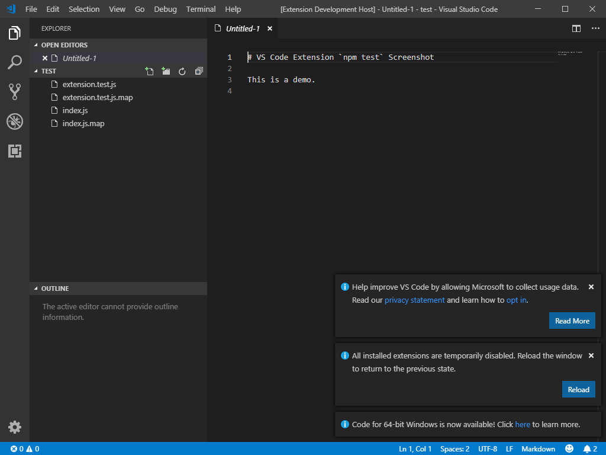

# VS Code `npm test` Screenshot

- [ ] Update this to recap findings now that this experiment has been a success

In this repository I demonstrate a process whereby a VS Code extension's test suite contains methods (faux unit tests)
which connect to the VS Code extension host window using CDP and uses the Electron's `capturePage` API to capture a
screenshot of the VS Code extension host window automatically.

The faux unit test method contains scene setup code so that multiple screenshots can be taken displaying various stages
of whatever functionality the extension implements and wishes to display and these screenshots may then be referenced in
the extensions README file or anywhere else.

To test this, I've bootstrapped a VS Code extension in this repository. The easiest way to connect to the VS Code extension
host window would be to start the `code` process with the `--inspect` CLI argument. Any Electron-based app started this way
will start a CDP server which can be then connected to and from there, the developer tools console can be used to issue
commands.

Unfortunately, the default Yeoman VS Code extension template does not allow any control over the Code CLI arguments. The
process is started by a script in `node_modules/vscode/bin/test` which downloads a test instance of VS Code and runs if with
a fixed set of CLI arguments which does not include `--inspect` are is not user-extensible without patching the file itself.
This file is referenced in `npm test`.

I want to avoid patching anything in `node_modules` so I pursue another option, which is to find the PID of the extension
host process from within itself and use Node's `process._debugProcess` API to nudge it to start the CDP server after it's
been started.

Normal Electron apps start 3 processes and VS Code starts about a dozen, so I need to determine a way to find the right PID.
Only one of the `code` PIDs will respond to `process._debugProcess` by opening up the CDP server and writing the web socket
connection details into its standard output.

- [ ] Find out if the debugger attachment line appears in `node_modules/bin/test` VS Code output it relays to the terminal

The easiest way to determine the PID of the process which is the main Electron process (and has the main process JavaScript
context) is to find other `code` processes which were started by processes who themselves are `code`. For each running `code`
process, if its parent process ID refers to another `code` process, I ignore it and look for a single `code` process whose
parent PID is not a PID of another `code` process.

This works is done in `screenshot/main.csx`.

If multiple `code` instances were running, this script would fail, but VS Code already demands that it be the sole instance
running when running `npm test` so this is not a concern as this limitation is aligned with VS Code itself.

The next step is to take this PID and run a node script which takes it and runs `process._debugProcess` on it.
This is in `screenshot/debug.js`.

At this point we can sanity-check this works with VS Code. Open two terminals side by side and in one run `code --wait` and
in the other `cd screenshot && dotnet script main.csx`. You should see that it finds the correct PID and pings VS Code to
enter debug mode at which point the first terminal where VS Code was ran will show something like:

```
Debugger listening on ws://127.0.0.1:9229/00000000-0000-0000-0000-000000000000
For help, see: https://nodejs.org/en/docs/inspector
```

We do this sanity check in the code by calling `http://localhost:9229/json`.
The URL is a part of a set of HTTP endpoints a debugging-enabled process exposes, more on the topic here:
https://chromedevtools.github.io/devtools-protocol/#endpoints
At some point it would be good to check the port if we can read it, but it's the default so whatever for now.

We can connect to the process using any CDP compatible client, like `chrome://inspect` or a CDP JavaScript library.
We use the CDP method https://chromedevtools.github.io/devtools-protocol/tot/Runtime#method-compileScript to execute a
snippet which will capture the window screenshot and save it to a known location.

See `npm test` and `src/test`



- [ ] See if in v1.35 `--inspect` could be passed using `launch.json`:
  https://github.com/microsoft/vscode-docs/blob/vnext/api/working-with-extensions/testing-extension.md

- [ ] See if `CODE_TESTS_WORKSPACE` could be abused by supplying `--inspect` there
- [ ] Release this as an NPM library

- [ ] Figure out how to use `Page.captureScreenshot` and `Page.startScreencast`
  
  `captureScreenshot` example
  ```javascript
  console.log('Subscribing to callbacks…');
  socket.on('message', async data => {
    console.log(data); // 'Page.captureScreenshot' wasn't found
    assert.ok(data);
    const buffer = Buffer.from(String(data), 'base64');
    console.log('Saving the screenshot buffer…');
    // Note that `process.cwd()` is in `.vscode-test/vscode-version`
    await fs.writeFile('../../screenshot.png', buffer);
  });

  console.log('Capturing the screenshot');
  socket.send(JSON.stringify({ id: 1, method: 'Page.captureScreenshot' }));
  ```

  `startScreencast` example
  ```javascript
  console.log('Subscribing to callbacks…');
  socket.on('message', async data => {
    console.log(data);
  });

  console.log('Starting the screencast');
  socket.send(JSON.stringify({ id: 1, method: 'Page.startScreencast' }));
  ```

  - [ ] See if `Page.startScreencast` might work for animated GIFs for the README
        
    Check out https://github.com/eugeneware/gifencoder and `get-pixels` for Base64 to RGBA array for it
