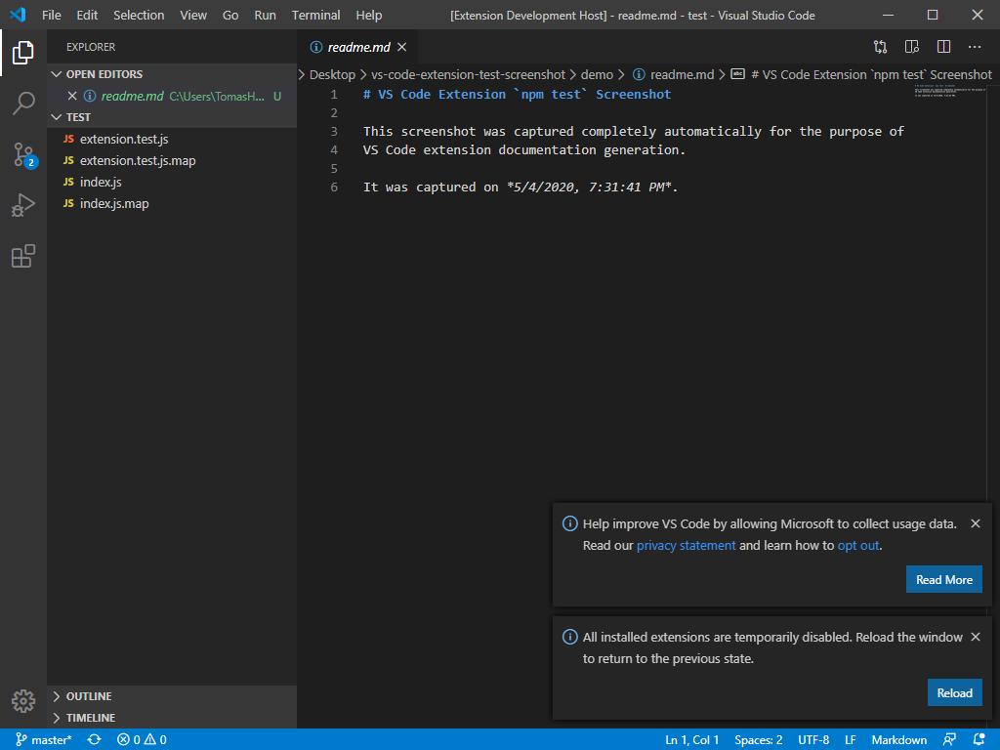
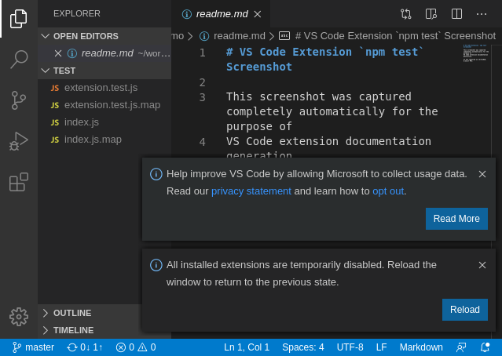

# VS Code `npm test` Screenshot

This repository contains a VS Code extension which has a faux test which does
the following:

- Dresses the extension host window by opening a generated demo MarkDown doc
- Finds the PID of the running VS Code extension host process (self-window)
- Attaches a debugger to self and connect to the debugger using CDP over WS
- Executes a script within the context of the host to capture its screenshot

This is a proof of concept and I plan on making it into a library which could be
used by any VS Code extension. The utility of this would be to in addition to
having a normal test suite have a test suite which would generates screenshots
showcasing the extension functionality for the docs and the readme.

## Running

`npm test` generates `screenshot.png`

## Screenshots

These are the latest screenshots coming from the
[workflow](.github/workflows/main.yml)

### win32



### linux



## Notes

The easiest way to attach a debugger to a VS Code window is to start it with
`--inspect`, but we cannot pass this switch to the extension host window in any
way without manually patching the infrastructure the Yeoman VS Code extension
template sets up and we want to avoid manual patching of any sort.

The extension host is started using a script in `node_modules/vscode/bin/test`
which downloads the latest version of VS Code and runs it with a fixed set of
CLI arguments (which do not include `--inspect`). This is run via `npm test`.

It may be possible to pass the `--inpect` switch now with current version of VS
Code, but I haven't looked into it yet.
https://github.com/microsoft/vscode-docs/blob/vnext/api/working-with-extensions/testing-extension.md#debugging-the-tests

The VS Code extension host won't run unless it is the only VS Code instance
running. We take advantage of this when finding the main VS Code process PID,
because VS Code starts multiple (about a dozen) and we look for one whose parent
PID is not VS Code. This will break when the VS Code extension host is made to
be able to run with other instances of VS Code running (there will be multiple
VS Code processes and we will need to use something like the window title then),
but it is not a concern until Microsoft has enabled that.

## To-Do

### Fix a black screen coming out of XVFB in GitHub Actions

Afterwards, remove the `touch` in the workflow as it won't be needed, since the
screenshot contain the current date, they will always have a change and thus
there will be changes to commit.

### Matrix the GitHub Actions workflow and collect screenshots for all platforms

### Package this as a library

### Look into `Page.captureScreenshot` and `Page.startScreencast`

`captureScreenshot` example
```javascript
console.log('Subscribing to callbacks…');
socket.on('message', async data => {
  console.log(data); // 'Page.captureScreenshot' wasn't found
  assert.ok(data);
  const buffer = Buffer.from(String(data), 'base64');
  console.log('Saving the screenshot buffer…');
  // Note that `process.cwd()` is in `.vscode-test/vscode-version`
  await fs.writeFile('../../screenshot.png', buffer);
});

console.log('Capturing the screenshot');
socket.send(JSON.stringify({ id: 1, method: 'Page.captureScreenshot' }));
```

`startScreencast` example
```javascript
console.log('Subscribing to callbacks…');
socket.on('message', async data => {
  console.log(data);
});

console.log('Starting the screencast');
socket.send(JSON.stringify({ id: 1, method: 'Page.startScreencast' }));
```

See if `Page.startScreencast` might work for animated GIFs for the README.
        
Check out https://github.com/eugeneware/gifencoder and `get-pixels` for Base64 to RGBA array for it.
